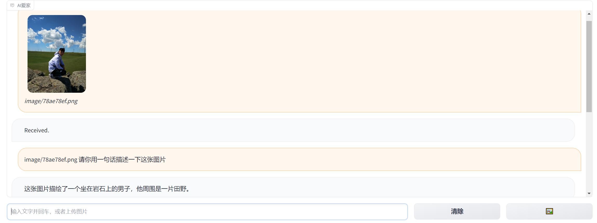
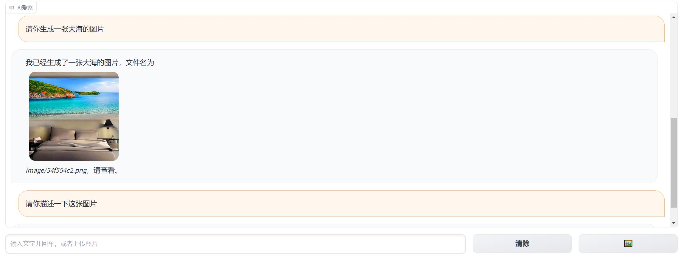
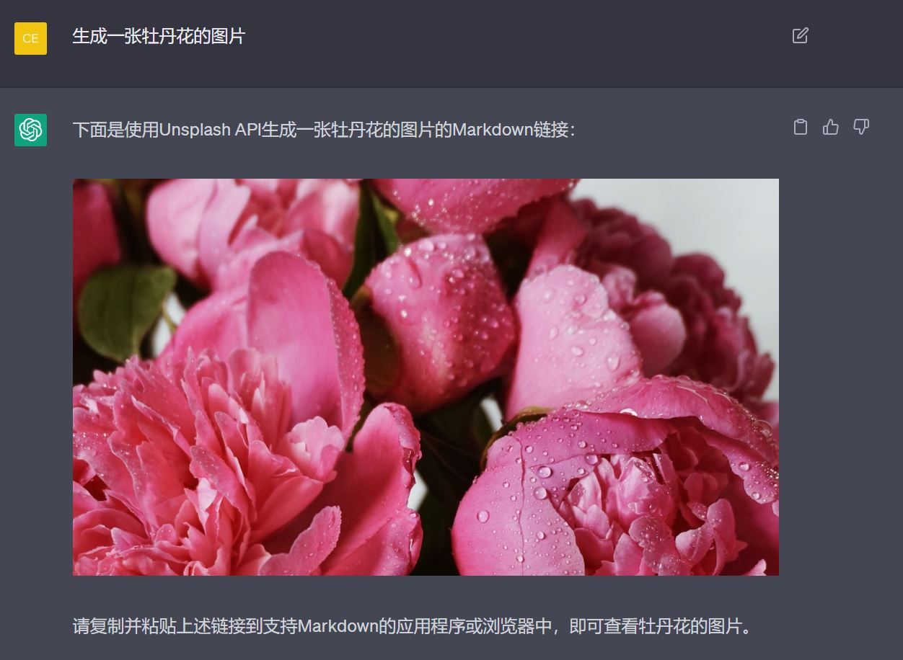

# AI爱家输入输出添加图片

## 1.Visual ChatGPT
这部分能使用Langchain连接ChatGPT和一些可视化组件，例如：Stable diffusion, GroundingDINO等，旨在能够在聊天过程中接受和发送图像。

使用方法：
- 安装所需库
- 设置您的[OpenAI API key](https://platform.openai.com/account/api-keys)
- 运行ChatGPT可视化部分，代码会创建一个对话机器人实例，并通过[Gradio](https://gradio.app/)库产生一个包含文本、图片输入及清除功能的共享链接(格式为xxxxxxxxxxxx.gradio.live)，需要注意的是需根据电脑使用GPU或CPU型号更换模型修改
```
Advice for CPU Users:
load = "ImageCaptioning_cpu,Text2Image_cpu"

 Advice for 1 Tesla T4 15GB  (Google Colab):                       
load = "ImageCaptioning_cuda:0,Text2Image_cuda:0"
                                
 Advice for 4 Tesla V100 32GB:                            
load = "Text2Box_cuda:0,Segmenting_cuda:0,
    Inpainting_cuda:0,ImageCaptioning_cuda:0,
    Text2Image_cuda:1,Image2Canny_cpu,CannyText2Image_cuda:1,
    Image2Depth_cpu,DepthText2Image_cuda:1,VisualQuestionAnswering_cuda:2,
    InstructPix2Pix_cuda:2,Image2Scribble_cpu,ScribbleText2Image_cuda:2,
    SegText2Image_cuda:2,Image2Pose_cpu,PoseText2Image_cuda:2,
    Image2Hed_cpu,HedText2Image_cuda:3,Image2Normal_cpu,
    NormalText2Image_cuda:3,Image2Line_cpu,LineText2Image_cuda:3"
```

代码如下：[VisualChatGPT](VisualChatGPT.ipynb)
效果如下：



参考文档：
[TaskMatrix](https://github.com/microsoft/TaskMatrix)
[listen_data_blog](https://www.listendata.com/2023/03/complete-guide-to-visual-chatgpt.html#id-d832be)

## 2.Unsplash让ChatGPT生成图片 <span style="color: red;">pending：生成图片质量差弃用。</span>
这部分利用[Unsplash](https://unsplash.com/documentation)模块，通过输入以下prompt后能让ChatGPT在聊天框中输出图片或图片链接:
```
从现在起 当你想发送一张照片时，请使用Markdown，并且不要有反斜线，不要用代码块。使用Unsplash API(https://source.unsplash.com/1280*720/?<在这里填写API key>。如果你明白了，请回复“明白”
```
效果如下：

参考文档：
[如何让chatgpt给我们发送或生成图片](https://zhuanlan.zhihu.com/p/607465592)
